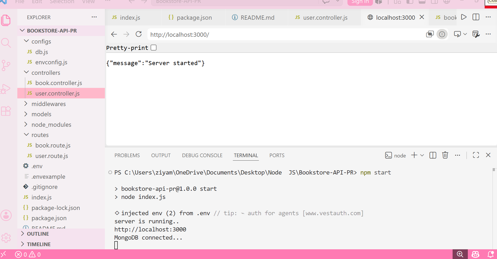

# 📚 BookStore API 

## Overview

BookStore API is a RESTful backend application built using **Node.js**, **Express.js**, and **MongoDB (Mongoose)**. This project provides complete CRUD operations for managing books and users. It follows a structured backend architecture and demonstrates how to build scalable APIs with database integration, authentication, and resource management.

The API allows users to register, log in, and manage book records efficiently through different endpoints.

---

## 🚀 Features

### 📖 Book Management

The following operations are available for books:

* Create a new book
* Get all books
* Get a book by ID
* Update book details
* Delete a book

### 👤 User Management

The following operations are available for users:

* User Registration
* User Login
* Get all users
* Get user by ID
* Update user details
* Delete user

---

## 🛠️ Tech Stack

* Node.js
* Express.js
* MongoDB
* Mongoose
* REST API

---

## 🎥 Demo Video

A complete demonstration of the project can be found below:

**Demo Video:** *(Add your video link here)*

---

## 📸 Screenshots

---

## 📂 API Endpoints

### Book Routes

| Method | Endpoint   | Description       |
| ------ | ---------- | ----------------- |
| POST   | /books     | Create a new book |
| GET    | /books     | Get all books     |
| GET    | /books/:id | Get book by ID    |
| PUT    | /books/:id | Update book       |
| DELETE | /books/:id | Delete book       |

### User Routes

| Method | Endpoint        | Description     |
| ------ | --------------- | --------------- |
| POST   | /users/register | Register a user |
| POST   | /users/login    | Login user      |
| GET    | /users          | Get all users   |
| GET    | /users/:id      | Get user by ID  |
| PUT    | /users/:id      | Update user     |
| DELETE | /users/:id      | Delete user     |

---

## 📌 Conclusion

This BookStore API project demonstrates backend development using Node.js, Express.js, and MongoDB. It includes complete CRUD functionality for both books and users, making it a solid foundation for learning REST API development and database integration.